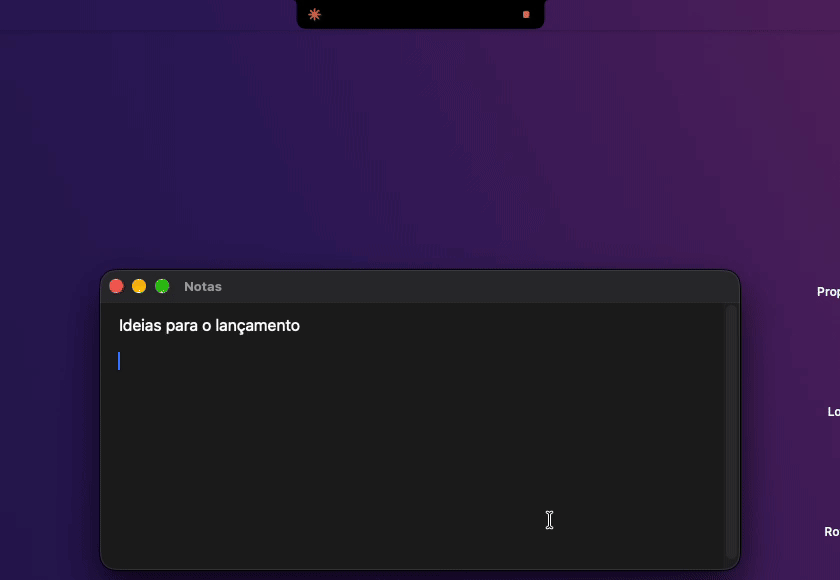
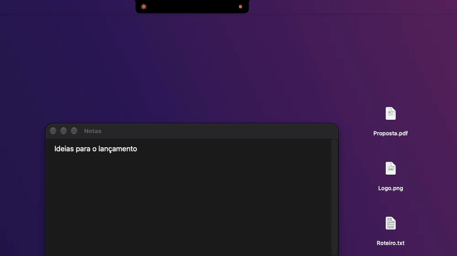
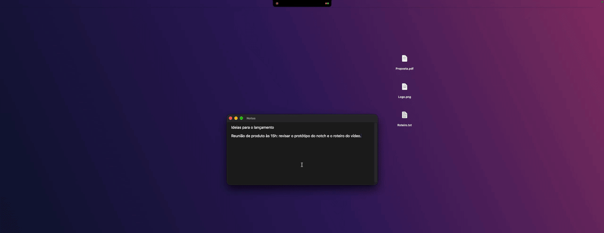

<p align="center">
  
</p>

<h1 align="center">boringCode</h1>

<p align="center">
  <b>Feito para pessoas não tão chatas assim.</b>
</p>

<p align="center">
  O notch do seu Mac para quem programa com IA: acompanhe o <b>Claude Code</b> e o <b>Codex</b>, aprove comandos,
  ache o que você copiou e mande arquivos para o celular, tudo ali em cima.<br>
  Um fork do <a href="https://github.com/TheBoredTeam/boring.notch">Boring Notch</a>, com música, calendário e shelf do jeito que você já conhece.
</p>

<p align="center">
  
  
  
  
  
  
  <a href="LICENSE"></a>
</p>

<p align="center">
  
</p>

<p align="center">
  <a href="#instalar">Instalar</a> ·
  <a href="#agentes-de-ia-no-notch">Agentes</a> ·
  <a href="#histórico-do-clipboard">Clipboard</a> ·
  <a href="#shelf-e-localsend">Shelf e LocalSend</a> ·
  <a href="#música-e-calendário">Música e calendário</a> ·
  <a href="#monitor-do-sistema">Monitor</a> ·
  <a href="#encaixe-de-janelas">Encaixe de janelas</a> ·
  <a href="#compilar">Compilar</a>
</p>

---

## Instalar

**Peça para a sua IA.** Cole isto no Claude Code, Codex ou Cursor:

```text
Instale o boringCode no meu Mac seguindo https://raw.githubusercontent.com/reesoousa/boringCode/HEAD/docs/instalar-com-ia.md
```

**Ou rode no Terminal:**

```bash
curl -fsSL https://raw.githubusercontent.com/reesoousa/boringCode/HEAD/scripts/install.sh | bash
```

- O [instalador](scripts/install.sh) baixa o app pronto da [Release](https://github.com/reesoousa/boringCode/releases) mais recente, sem compilar nada.
- Ele confere o SHA-256 e a assinatura, instala em **Aplicativos** e abre o app.
- Na primeira abertura, as boas-vindas perguntam quais recursos você quer e já pedem cada permissão do macOS.
- Depois disso, as versões novas chegam sozinhas.
- Requer macOS 14 ou mais novo, em Apple Silicon ou Intel.

**Ou pelo DMG:** baixe em [Releases](https://github.com/reesoousa/boringCode/releases) e siga o [guia de instalação](docs/instalar.md).

Para desinstalar, use o mesmo comando com `| bash -s -- --uninstall`. Ele também tira os hooks do Claude Code e do Codex.

O boringCode é outro app (`com.reesoousa.boringcode`), então dá para deixá-lo aberto junto com o Boring Notch original.

## Agentes de IA no notch

Siga o **Claude Code** (Terminal/iTerm, extensão do VS Code/Cursor e app Claude) e o **Codex** (CLI, VS Code e app Codex)
sem sair do que você está fazendo. Cada agente tem sua cor: Claude em laranja, Codex em azul.

| Situação | Notch fechado |
|---|---|
| Só música | capa do álbum à esquerda, espectro à direita (como no Boring Notch) |
| Música + agente | música à esquerda; **status do agente no lugar do espectro** |
| Só agente | status geral à esquerda, **um quadradinho por sessão** à direita |

Status: ✻ rodando · **!** precisa de aprovação · **?** pergunta para você · ✓ concluído · ✕ erro.

- **Aprovar ou recusar** comandos no próprio notch. Ele se abre sozinho quando chega um pedido e fecha quando você responde.
- **Responder perguntas** do Claude (múltipla escolha ou texto livre) sem ir até o terminal.
- **Passe o mouse do lado direito** do notch e ele abre direto na aba **Agentes**.
- **Clique na sessão** para voltar à aba certa do Terminal/iTerm, à janela do VS Code ou à conversa no app Codex.
- **Som sutil** quando um agente termina (dá para trocar o som ou desligar).

<details>
<summary><b>Como funciona por baixo</b></summary>

Ao abrir, o boringCode adiciona hooks em `~/.claude/settings.json` e `~/.codex/hooks.json` (salvando um backup antes e
**sem mexer nos hooks de outras ferramentas**). Cada hook chama um script local que conversa com o app por um socket em
`~/Library/Application Support/boringCode/`. Nada sai do seu Mac.

Se o boringCode estiver fechado, os hooks não fazem nada e o agente segue normal. Para remover: **Ajustes › Agentes de IA › Remover hooks**.
</details>

## Histórico do clipboard

> Novo — chega na versão **1.0**.

O que você copiou por último fica numa aba do notch, como o **Win+V** do Windows. Clique num item e ele é colado direto
no app em que você estava.

<p align="center">
  
</p>

- **Textos, links, imagens e arquivos**, cada um com uma prévia e o ícone do app de onde veio.
- **Busca e filtros** no topo: Tudo · Texto · Links · Imagens · Arquivos.
- **⌃⌘V** abre o clipboard de qualquer lugar (dá para trocar o atalho).
- **Botão direito** num cartão: colar, copiar, abrir o link, mostrar no Finder ou apagar.
- **Privado:** guarda os últimos 100 itens só neste Mac e nunca salva o que gerenciadores de senha marcam como sigiloso.

Na primeira vez, o macOS pede para o boringCode **colar de outros apps** (Privacidade e Segurança › Colar de Outros Apps).
Para colar sozinho, ele usa a permissão de **Acessibilidade**; sem ela, o item só é copiado.

## Shelf e LocalSend

Arraste arquivos até o notch para guardá-los na **Shelf** e levá-los para onde quiser depois.

<p align="center">
  
</p>

Na Shelf também dá para mandar e receber arquivos de celulares e computadores com o [LocalSend](https://localsend.org)
(iPhone, Android, Windows e Linux), na mesma rede, **sem abrir o app LocalSend**. Ele nem precisa estar instalado no Mac.

<p align="center">
  <br><br>
  
</p>

- **Enviar:** arraste um arquivo até o slot do LocalSend e clique no aparelho. O box enche com o progresso, mostra ✓ e o notch fecha.
- **Receber:** o notch abre sozinho, o arquivo aparece grande ("de iPhone do Renan") e voa até a Shelf, já selecionado.
  Ele também fica salvo em **Downloads**.
- **Seguro:** HTTPS com certificado dos dois lados (o mesmo protocolo do LocalSend 1.18). Os arquivos recebidos entram em
  quarentena, então o macOS avisa antes de abrir algo executável.

Para usar, escolha **LocalSend** em **Ajustes › Shelf › Quick Share Service** (o AirDrop continua sendo o padrão).
No iPhone, o LocalSend precisa estar aberto para aparecer e receber. Na primeira vez, o macOS pede permissão de
**Rede Local**, que é o que deixa o boringCode achar os aparelhos.

## Música e calendário

Passe o mouse no notch e veja o que está tocando, com controles, e os próximos compromissos do dia, como no Boring Notch.

<p align="center">
  
</p>

Funciona com Spotify, Apple Music, YouTube Music e o que mais estiver tocando no Mac. O calendário usa as contas do
app Calendário (e os Lembretes, se você quiser).

## Monitor do sistema

CPU, memória, armazenamento, bateria, download e upload num relance: é o botão ao lado do espelho, no notch aberto.

<p align="center">
  
</p>

As leituras vêm direto do sistema e **só acontecem com o monitor aberto**: fechado, ele não gasta nada.
Em **Ajustes › Monitor do sistema** você escolhe as métricas e o intervalo de atualização (1, 2 ou 5 s).

## Encaixe de janelas

Arraste uma janela pela barra de título até o notch: ele abre com seis layouts, **Metades, Terços, Foco, Quartos, Centro
e Preencher**. Passe por cima de uma zona e uma prévia mostra onde a janela vai ficar; solte e ela desliza até o lugar.

<p align="center">
  
</p>

Para continuar arrastando normalmente, é só se afastar do notch. Precisa da permissão de **Acessibilidade** (no macOS 27,
"Controle do Dispositivo e Acesso a Dados"), e o notch avisa e pede na primeira vez. Em **Ajustes › Encaixe de janelas**
você escolhe quais layouts mostrar, se a janela desliza e as margens entre as janelas.

## Configurações

Tudo vem ligado por padrão e se ajusta em **Ajustes**:

- **Agentes de IA:** monitorar agentes, indicador no notch fechado, abrir a aba ao passar o mouse, abrir o notch em
  pedidos de aprovação, som ao concluir, instalar ou remover hooks.
- **Clipboard:** guardar o histórico, quantos itens (25 a 200), colar ao escolher, atalho e limpar tudo.
- **Shelf › LocalSend:** enviar e receber, receber automaticamente, abrir o notch quando chegar um arquivo e o nome
  deste Mac para os outros aparelhos.
- **Monitor do sistema** e **Encaixe de janelas:** o que mostrar e como.

## Compilar

Para mexer no código: macOS 14+ e Xcode 16+. Para só usar o app, veja [Instalar](#instalar).
Os detalhes para desenvolver, como a assinatura de dev e os scripts, estão no [CLAUDE.md](CLAUDE.md).

```bash
git clone -b dev https://github.com/reesoousa/boringCode.git
cd boringCode
xcodebuild -project boringNotch.xcodeproj -scheme boringNotch -configuration Release \
  -derivedDataPath build -destination 'platform=macOS,arch=arm64' build
open build/Build/Products/Release/boringCode.app
```

Na primeira vez que você clicar numa sessão do Terminal/iTerm, o macOS pede permissão de automação. É o que
permite focar a aba certa.

## Roadmap

- [x] Claude Code (terminal, VS Code, app Claude) e Codex
- [x] Aprovar/recusar e responder perguntas no notch
- [x] LocalSend integrado na Shelf (enviar e receber sem abrir o app)
- [x] Monitor do sistema (CPU, memória, armazenamento, bateria, rede)
- [x] Encaixe de janelas arrastando até o notch
- [x] Atualizações automáticas e boas-vindas que pedem cada permissão na hora
- [x] Histórico do clipboard (na 1.0)
- [ ] Notarização (Developer ID)

O que já entrou para a próxima versão está em [`docs/1.0.md`](docs/1.0.md).

## Créditos e licença

- [Boring Notch](https://github.com/TheBoredTeam/boring.notch), do TheBoredTeam: a base de todo o app e do design.
  O README original está em [`docs/README-boring-notch.md`](docs/README-boring-notch.md).
- [Open Island](https://github.com/Octane0411/open-vibe-island), de Octane0411: referência para a integração com agentes
  (ponte por hooks, fluxo de aprovação, foco no terminal, layout do notch fechado).
- [LocalSend](https://github.com/localsend/localsend): o [protocolo](https://github.com/localsend/protocol) que o
  boringCode fala para trocar arquivos com o app deles (implementação própria, sem código do LocalSend).
- [Sapphire](https://github.com/cshariq/Sapphire): a ideia das "Snap Zones" no notch (implementação própria, sem
  código do Sapphire).

Distribuído sob a [GPL-3.0](LICENSE), a mesma licença dos dois projetos.
