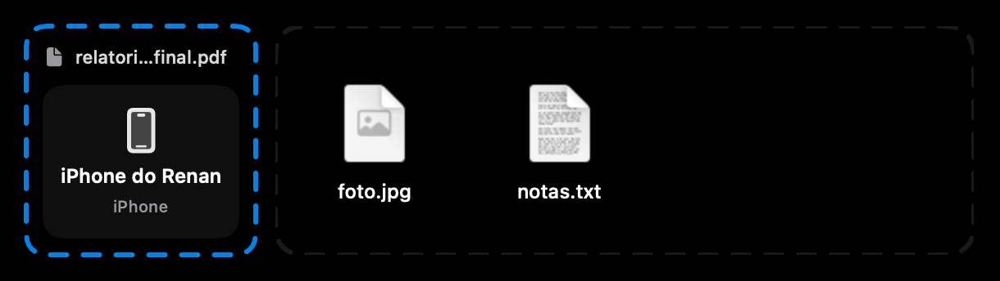
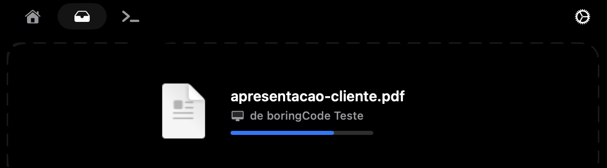

<p align="center">
  
</p>

<h1 align="center">boringCode</h1>

<p align="center">
  <b>Feito para pessoas não tão chatas assim.</b>
</p>

<p align="center">
  O notch do seu MacBook para quem programa com IA: música, calendário e shelf do
  <a href="https://github.com/TheBoredTeam/boring.notch">Boring Notch</a> —
  e agora seus agentes do <b>Claude Code</b> e do <b>Codex</b> bem ali em cima, e arquivos indo e vindo
  do celular pelo <b>LocalSend</b>.
</p>

<p align="center">
  
  
  
  
  
  
  <a href="LICENSE"></a>
</p>

<p align="center">
  <br><br>
  
</p>

---

## O que é

O **boringCode** é um fork do [Boring Notch](https://github.com/TheBoredTeam/boring.notch) que mantém tudo o que ele já faz
(player de música com espectro, calendário, shelf de arquivos, espelho, OSD de volume/brilho) e adiciona um
**módulo de agentes de IA**, inspirado no [Open Island](https://github.com/Octane0411/open-vibe-island), e o
**LocalSend integrado ao shelf** para mandar e receber arquivos do celular.

Roda lado a lado com o Boring Notch original — é outro app (`com.reesoousa.boringcode`).

## Agentes de IA no notch

Funciona com o **Claude Code** (Terminal/iTerm, extensão do VS Code/Cursor e app Claude) e com o **Codex** (CLI, VS Code e app Codex).
Cada agente tem sua cor: Claude em laranja, Codex em azul.

| Situação | Notch fechado |
|---|---|
| Só música | capa do álbum à esquerda, espectro à direita (como no Boring Notch) |
| Música + agente | música à esquerda; **status do agente no lugar do espectro** |
| Só agente | status geral à esquerda, **um quadradinho por sessão** à direita |

Status: ✻ rodando · **!** precisa de aprovação · **?** pergunta para você · ✓ concluído · ✕ erro.

- **Passe o mouse do lado do agente** (à direita do notch) e ele abre direto na aba **Agentes**.
- **Aprovar ou recusar** comandos sem sair do que você está fazendo — o notch se abre sozinho quando chega um pedido.
- **Responder perguntas** do Claude (múltipla escolha ou texto livre) no próprio notch.
- **Clique na sessão** para voltar à aba certa do Terminal/iTerm, à janela do VS Code ou à conversa no app Codex.
- **Som sutil** quando um agente termina (dá para trocar o som ou desligar).

### Como funciona

Ao abrir, o boringCode adiciona hooks em `~/.claude/settings.json` e `~/.codex/hooks.json` (salvando um backup antes e
**sem mexer nos hooks de outras ferramentas**). Cada hook chama um script local que conversa com o app por um socket em
`~/Library/Application Support/boringCode/`. Nada sai do seu Mac.

Se o boringCode estiver fechado, os hooks não fazem nada e o Claude segue normal. Para remover: **Ajustes › Agentes de IA › Remover hooks**.

## LocalSend no shelf: arquivos do e para o celular

Envie e receba arquivos de celulares e computadores com [LocalSend](https://localsend.org) (iPhone, Android,
Windows, Linux) na mesma rede, **sem abrir o app LocalSend** — ele nem precisa estar instalado no Mac.

<p align="center">
  <br><br>
  
</p>

- **Enviar:** arraste um arquivo até o slot do LocalSend. Ele abre mostrando o nome do arquivo e os aparelhos por
  perto; clique no aparelho e pronto — o box enche com o progresso, mostra ✓ e o notch fecha.
- **Receber:** o notch abre sozinho, o arquivo aparece grande ("de iPhone do Renan") e voa até o shelf, já
  selecionado para você arrastar. Ele também fica salvo em **Downloads**.
- **Seguro:** HTTPS com certificado dos dois lados (o mesmo protocolo do LocalSend 1.18), e os arquivos recebidos
  entram em quarentena — o macOS avisa antes de abrir algo executável.

Para usar, escolha **LocalSend** em **Ajustes › Shelf › Quick Share Service** (o AirDrop continua sendo o padrão).
No iPhone, o LocalSend precisa estar aberto para aparecer e receber. Na primeira vez, o macOS pede permissão de
**Rede Local** — é o que deixa o boringCode achar os aparelhos.

## Monitor do sistema

CPU, memória, armazenamento, bateria, download e upload num relance: o botão ao lado do espelho, no notch aberto,
abre seis cartões no visual do Boring Notch — eles chegam em cascata, as barrinhas crescem e os números contam até o
valor atual. As leituras vêm direto do sistema e **só acontecem
com o monitor aberto**: fechado, não gasta nada. Ajustes › Monitor do sistema: quais métricas mostrar e o intervalo de
atualização (1, 2 ou 5 s).

## Encaixe de janelas

Arraste uma janela pela barra de título até o notch: ele abre com seis layouts — **Metades, Terços, Foco, Quartos,
Centro e Preencher**. Passe por cima de uma zona e uma prévia translúcida mostra onde a janela vai ficar; solte e ela
desliza até o lugar (vai direto com Reduzir movimento). Para continuar arrastando normalmente, é só se afastar do
notch. Precisa da permissão de **Acessibilidade** (no macOS 27, "Controle do Dispositivo e Acesso a Dados") — o notch
avisa e pede na primeira vez. Ajustes › Encaixe de janelas: quais layouts mostrar, deslizar ou não, e margens entre
as janelas.

## Instalação

**Pelo instalador:** baixe o `.dmg` em [Releases](https://github.com/reesoousa/boringCode/releases) e siga o
[guia de instalação](docs/instalar.md). O app é assinado, mas não notarizado: na primeira abertura o macOS pede
para liberar em **Ajustes › Privacidade e Segurança › Abrir mesmo assim**.

**Compilando:** macOS 14+, Xcode 16+.

```bash
git clone -b dev https://github.com/reesoousa/boringCode.git
cd boringCode
xcodebuild -project boringNotch.xcodeproj -scheme boringNotch -configuration Release \
  -derivedDataPath build -destination 'platform=macOS,arch=arm64' build
open build/Build/Products/Release/boringCode.app
```

Na primeira vez que você clicar numa sessão do Terminal/iTerm, o macOS pede permissão de automação — é o que
permite focar a aba certa.

## Configurações

**Ajustes › Agentes de IA** (tudo ligado por padrão):

- Monitorar agentes de IA
- Indicador de status no notch fechado
- Passar o mouse no indicador abre a aba Agentes
- Abrir o notch quando um agente pedir aprovação
- Som ao concluir (e qual som)
- Status da conexão com o Claude Code, instalar/remover hooks

**Ajustes › Shelf › LocalSend** (tudo ligado por padrão):

- Enviar e receber pelo LocalSend
- Receber arquivos automaticamente
- Abrir o notch quando chegar um arquivo
- Nome deste Mac para os outros aparelhos

## Roadmap

- [x] Claude Code (terminal, VS Code, app Claude)
- [x] Aprovar/recusar e responder perguntas no notch
- [x] LocalSend integrado no shelf (enviar e receber sem abrir o app)
- [x] Codex
- [x] Instalador `.dmg` assinado (Apple ID pessoal, sem notarização)
- [x] Ícone próprio
- [x] Monitor do sistema (CPU, memória, armazenamento, bateria, rede)
- [x] Encaixe de janelas arrastando até o notch
- [ ] Atualizações automáticas (Sparkle com appcast próprio)
- [ ] Notarização (Developer ID)

## Créditos e licença

- [Boring Notch](https://github.com/TheBoredTeam/boring.notch), do TheBoredTeam — a base de todo o app e do design.
  O README original está em [`docs/README-boring-notch.md`](docs/README-boring-notch.md).
- [Open Island](https://github.com/Octane0411/open-vibe-island), de Octane0411 — referência para a integração com agentes
  (ponte por hooks, fluxo de aprovação, foco no terminal, layout do notch fechado).
- [LocalSend](https://github.com/localsend/localsend) — o [protocolo](https://github.com/localsend/protocol) que o
  boringCode fala para trocar arquivos com o app deles (implementação própria, sem código do LocalSend).
- [Sapphire](https://github.com/cshariq/Sapphire) — a ideia das "Snap Zones" no notch (implementação própria, sem
  código do Sapphire).

Distribuído sob a [GPL-3.0](LICENSE), a mesma licença dos dois projetos.
